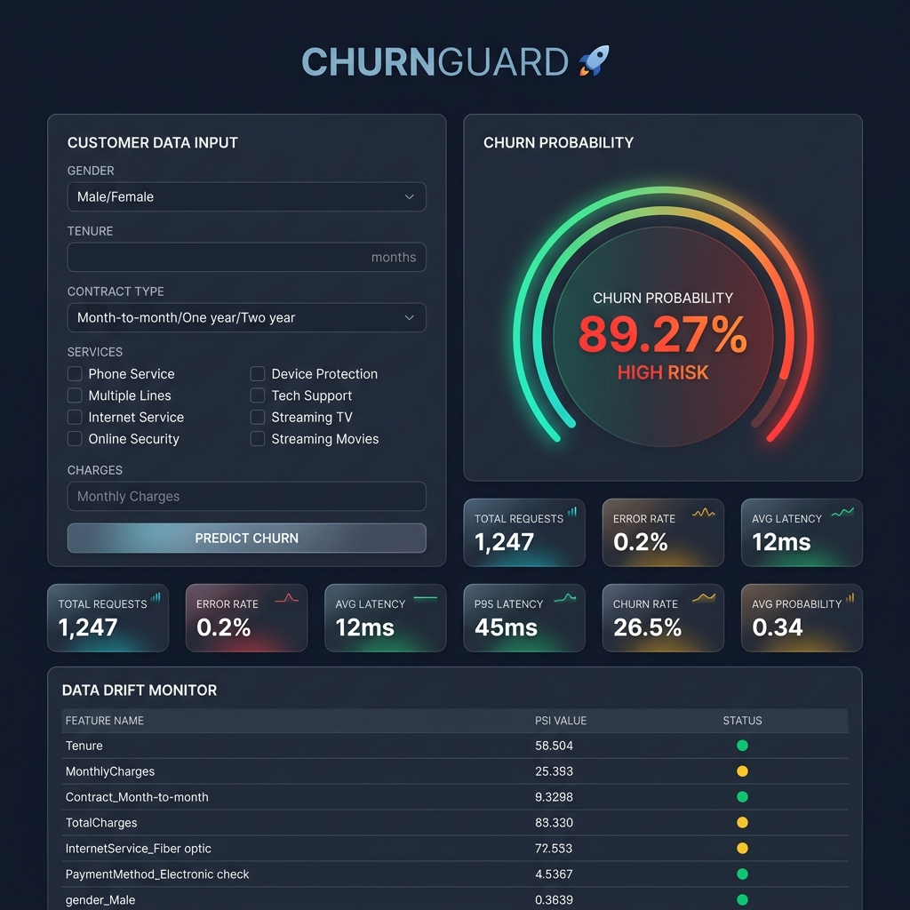
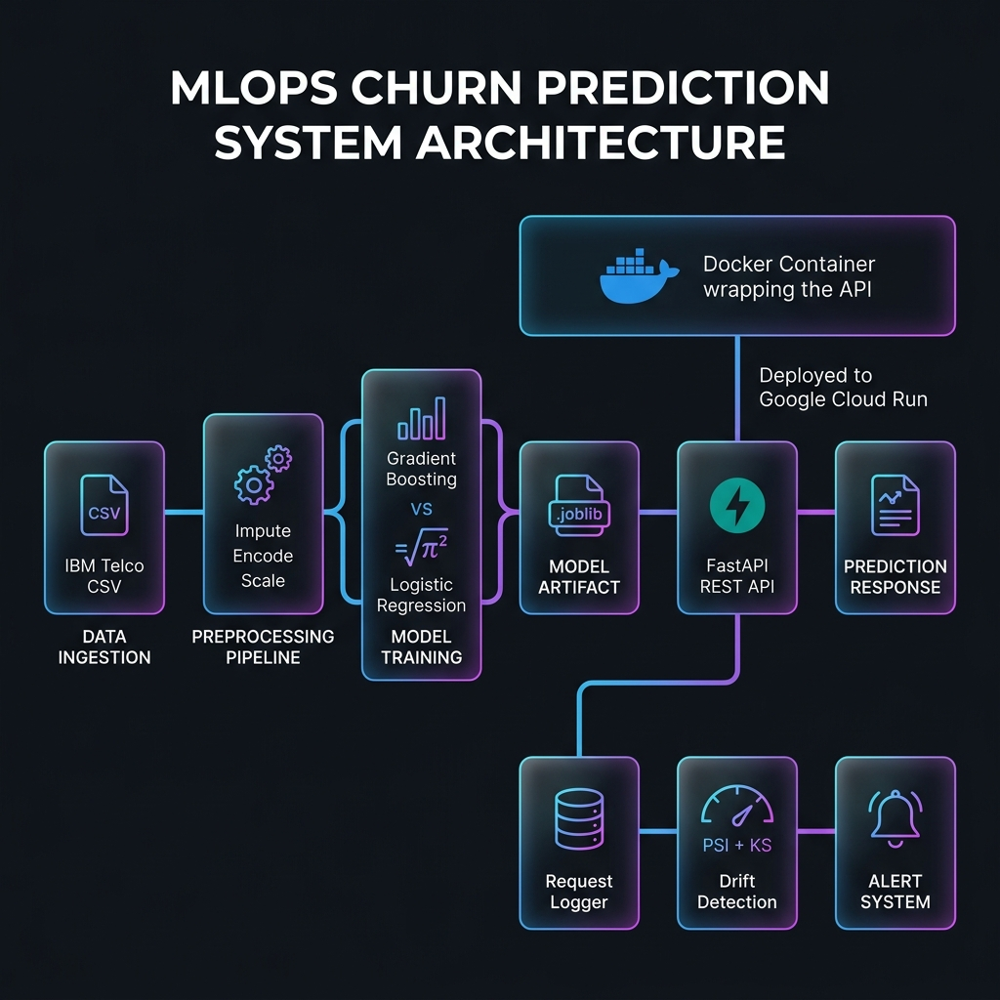
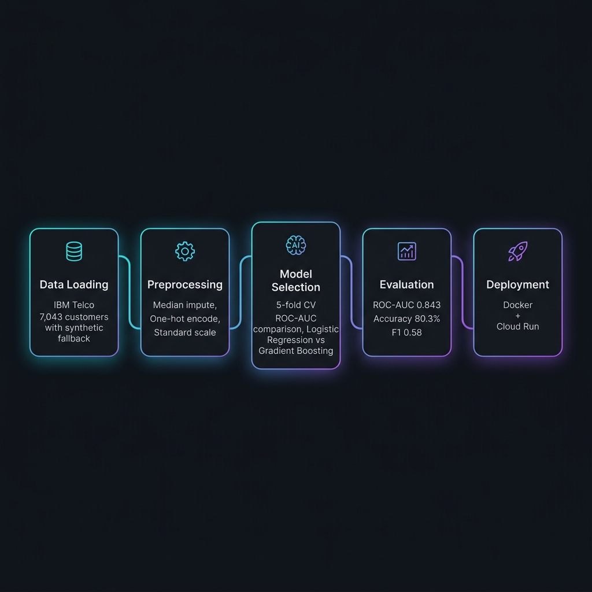
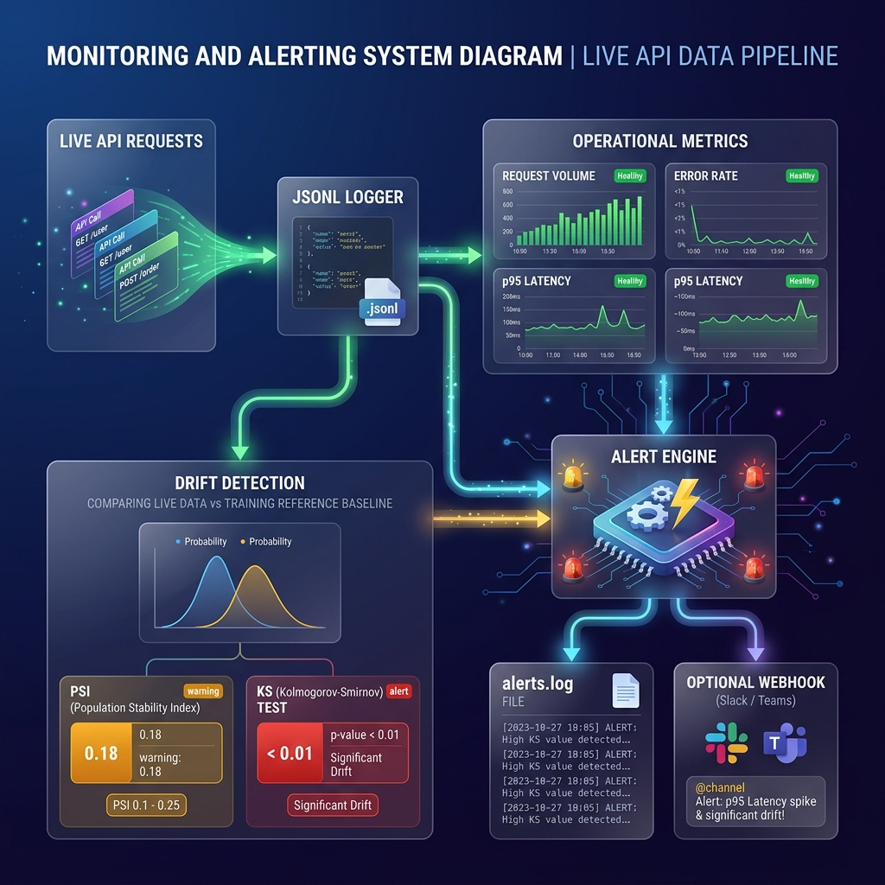

<div align="center">

# 🛡️ ChurnGuard — End-to-End MLOps Churn Prediction

**Predict → Serve → Monitor → Alert — all in one production-ready system.**

[](https://python.org)
[](https://fastapi.tiangolo.com)
[](https://scikit-learn.org)
[](https://docker.com)
[](https://cloud.google.com/run)
[](LICENSE)
[](#-testing)

<br>

*A production-grade machine learning system that predicts telecom customer churn, served as a FastAPI REST API with built-in request logging, statistical drift detection (PSI + KS), and automated alerting. Fully containerized for Google Cloud Run deployment.*

<br>



<br>

</div>

---

## 📑 Table of Contents

- [✨ Features](#-features)
- [🏗️ System Architecture](#️-system-architecture)
- [🧠 ML Pipeline](#-ml-pipeline)
- [📊 Model Performance](#-model-performance)
- [📂 Project Structure](#-project-structure)
- [🚀 Quickstart](#-quickstart)
- [🌐 API Reference](#-api-reference)
- [🎨 Frontend Dashboard](#-frontend-dashboard)
- [📡 Monitoring, Drift & Alerting](#-monitoring-drift--alerting)
- [🧪 Testing](#-testing)
- [🐳 Docker & Cloud Deployment](#-docker--cloud-deployment)
- [⚙️ Configuration](#️-configuration)
- [🛣️ Roadmap](#️-roadmap)
- [🤝 Contributing](#-contributing)
- [📄 License](#-license)

---

## ✨ Features

<table>
<tr>
<td width="50%">

### 🤖 Machine Learning
- **Automated model selection** — GradientBoosting vs LogisticRegression compared via 5-fold CV ROC-AUC
- **Full sklearn Pipeline** — preprocessing + model in one serializable artifact
- **Risk banding** — low / medium / high churn risk classification
- **Configurable decision threshold** — tune the probability cutoff for your business cost

</td>
<td width="50%">

### 🔌 Production API
- **FastAPI REST API** with OpenAPI/Swagger docs
- **Single & batch prediction** endpoints
- **Pydantic validation** — invalid inputs rejected at the edge with 422
- **Health checks** — liveness/readiness probes for orchestrators

</td>
</tr>
<tr>
<td>

### 📈 Monitoring & Alerting
- **Request logging** — every prediction logged to JSONL with latency tracking
- **Statistical drift detection** — PSI + KS tests vs training baseline
- **Automated alerts** — drift, latency, error rate → log file + optional webhook (Slack/Teams)
- **Operational metrics** — volume, error rate, p95 latency, churn rate

</td>
<td>

### 🚀 Deployment
- **Docker-ready** — Cloud Run-compatible container image
- **Cloud Build CI/CD** — build → push → deploy pipeline
- **One-command deploy** — scripted Cloud Run deployment
- **Self-contained** — model baked into image, zero external dependencies

</td>
</tr>
</table>

---

## 🏗️ System Architecture

<div align="center">

</div>

<br>

The system follows a clean separation of concerns:

```
┌─────────────────────────────────────────────────────────────────────┐
│                        Google Cloud Run                             │
│  ┌───────────────────────────────────────────────────────────────┐  │
│  │                     Docker Container                          │  │
│  │                                                               │  │
│  │   Client ──► FastAPI ──► sklearn Pipeline ──► Response        │  │
│  │                 │              │                               │  │
│  │                 ▼              ▼                               │  │
│  │           JSONL Logger   Model Artifact                       │  │
│  │                 │         (.joblib)                            │  │
│  │           ┌─────┴─────┐                                       │  │
│  │           ▼           ▼                                       │  │
│  │     Drift Engine  Ops Metrics                                 │  │
│  │      (PSI + KS)   (p95, err%)                                 │  │
│  │           └─────┬─────┘                                       │  │
│  │                 ▼                                             │  │
│  │           Alert System ──► Webhook (Slack/Teams)              │  │
│  └───────────────────────────────────────────────────────────────┘  │
└─────────────────────────────────────────────────────────────────────┘
```

---

## 🧠 ML Pipeline

<div align="center">

</div>

<br>

The training pipeline (`src/train.py`) automates the full lifecycle:

| Stage | Details |
|-------|---------|
| **1. Data Ingestion** | Downloads IBM Telco Customer Churn dataset (7,043 customers). Synthetic fallback for offline use. |
| **2. Preprocessing** | `ColumnTransformer` pipeline: median imputation (numeric), most-frequent imputation (categorical), one-hot encoding, standard scaling |
| **3. Model Selection** | 5-fold stratified CV on ROC-AUC. Compares `LogisticRegression` (balanced) vs `GradientBoostingClassifier` |
| **4. Evaluation** | Hold-out set (20%) evaluation: ROC-AUC, accuracy, precision, recall, F1 |
| **5. Artifact Persistence** | Saves `churn_model.joblib` (full Pipeline) + `metadata.json` (metrics & provenance) |
| **6. Reference Baseline** | Builds `reference_profile.json` for drift detection (distribution stats per feature) |

---

## 📊 Model Performance

The selected **Gradient Boosting Classifier** outperformed Logistic Regression on cross-validated ROC-AUC:

<div align="center">

| Metric | Score |
|:-------|------:|
| **ROC-AUC** | **0.843** |
| Accuracy | 0.803 |
| Precision (churn) | 0.666 |
| Recall (churn) | 0.516 |
| F1 Score (churn) | 0.581 |
| Class Balance | 26.5% churn / 73.5% stay |

</div>

### Cross-Validation Comparison

```
Model                      CV ROC-AUC
─────────────────────────  ──────────
Logistic Regression        0.8454
Gradient Boosting ✅       0.8470
```

> **Note:** The model uses a `0.5` decision threshold by default. Adjust `DECISION_THRESHOLD` in `config.py` to trade precision for recall based on your business cost of false negatives vs false positives.

---

## 📂 Project Structure

```
churn-mlops/
│
├── 📄 config.py                    # Central config: paths, features, thresholds
├── 📄 requirements.txt             # Python dependencies
├── 🐳 Dockerfile                   # Cloud Run-compatible container
├── ☁️  cloudbuild.yaml              # GCP Cloud Build CI/CD pipeline
│
├── 📁 app/
│   └── main.py                     # FastAPI application (8 endpoints)
│
├── 📁 src/
│   ├── data/
│   │   └── load.py                 # Data download + synthetic fallback + ref profile
│   ├── train.py                    # Model selection, training, artifact export
│   ├── predict.py                  # Cached model loading + inference
│   ├── schema.py                   # Pydantic request/response models (Literal validation)
│   └── monitoring/
│       ├── logger.py               # JSONL request/prediction logger
│       ├── drift.py                # PSI + KS-based drift detection
│       └── alerts.py               # Threshold rules → alerts.log + webhook
│
├── 📁 frontend/
│   ├── index.html                  # ChurnGuard dashboard UI
│   ├── style.css                   # Glassmorphism dark-theme styles
│   └── script.js                   # Dashboard interactivity & API integration
│
├── 📁 data/
│   ├── telco_churn.csv             # Raw training data (7,043 records)
│   └── reference_profile.json      # Feature distribution baseline for drift
│
├── 📁 models/
│   ├── churn_model.joblib          # Trained sklearn Pipeline artifact
│   └── metadata.json               # Model version, metrics, provenance
│
├── 📁 logs/
│   ├── requests.jsonl              # Prediction request log
│   └── alerts.log                  # Triggered alert history
│
├── 📁 deploy/
│   └── cloudrun.sh                 # One-command Cloud Run deployment script
│
├── 📁 tests/
│   ├── conftest.py                 # Shared fixtures
│   ├── test_predict.py             # Inference unit tests
│   ├── test_api.py                 # API integration tests (TestClient)
│   └── test_drift.py              # Drift calculation tests
│
└── 📁 assets/                      # README images & diagrams
```

---

## 🚀 Quickstart

### Prerequisites

- Python 3.12+
- pip

### Installation

```bash
# Clone the repository
git clone https://github.com/YashRaj363/Churn_Prediction.git
cd Churn_Prediction

# Create a virtual environment (recommended)
python -m venv venv
source venv/bin/activate        # Linux/macOS
venv\Scripts\activate           # Windows

# Install dependencies
pip install -r requirements.txt
```

### Train & Serve

```bash
# Step 1: Download data & build drift baseline
python src/data/load.py
# 💡 Use --synthetic flag to skip download and use synthetic data

# Step 2: Train the model
python src/train.py
# → Outputs: models/churn_model.joblib + models/metadata.json

# Step 3: Launch the API server
python -m uvicorn app.main:app --host 0.0.0.0 --port 8080
```

### Try It Out

Open your browser:
- 🎨 **Dashboard** → [http://localhost:8080/ui](http://localhost:8080/ui)
- 📖 **Swagger Docs** → [http://localhost:8080/docs](http://localhost:8080/docs)

Or use `curl`:

```bash
curl -s -X POST http://localhost:8080/predict \
  -H "Content-Type: application/json" \
  -d '{
    "gender": "Female",
    "SeniorCitizen": 1,
    "Partner": "No",
    "Dependents": "No",
    "tenure": 1,
    "PhoneService": "Yes",
    "MultipleLines": "No",
    "InternetService": "Fiber optic",
    "OnlineSecurity": "No",
    "OnlineBackup": "No",
    "DeviceProtection": "No",
    "TechSupport": "No",
    "StreamingTV": "Yes",
    "StreamingMovies": "Yes",
    "Contract": "Month-to-month",
    "PaperlessBilling": "Yes",
    "PaymentMethod": "Electronic check",
    "MonthlyCharges": 95.0,
    "TotalCharges": 95.0
  }'
```

**Response:**

```json
{
  "churn_probability": 0.8927,
  "churn_prediction": true,
  "risk_band": "high",
  "decision_threshold": 0.5,
  "model_version": "20260701074757"
}
```

---

## 🌐 API Reference

| Method | Endpoint | Description |
|:------:|----------|-------------|
| `GET` | `/` | Service info — version, available endpoints |
| `GET` | `/health` | Liveness/readiness probe (`200` if model loaded, `503` otherwise) |
| `GET` | `/model` | Model metadata — type, version, metrics, features |
| `POST` | `/predict` | Score a **single** customer record |
| `POST` | `/predict/batch` | Score **multiple** customer records at once |
| `GET` | `/metrics` | Operational metrics — volume, error rate, latency, churn rate |
| `GET` | `/monitoring/report` | Full drift report + triggered alerts |
| `GET` | `/docs` | Interactive Swagger UI documentation |
| `GET` | `/ui` | ChurnGuard frontend dashboard |

### Request Schema

All 19 features from the IBM Telco dataset are required. Categorical values are validated via Pydantic `Literal` constraints — invalid values return a **422** with a descriptive error message.

<details>
<summary>📋 <strong>Full Feature Schema</strong> (click to expand)</summary>

| Feature | Type | Valid Values |
|---------|------|-------------|
| `gender` | string | `Male`, `Female` |
| `SeniorCitizen` | int | `0`, `1` |
| `Partner` | string | `Yes`, `No` |
| `Dependents` | string | `Yes`, `No` |
| `tenure` | int | `0` – `120` |
| `PhoneService` | string | `Yes`, `No` |
| `MultipleLines` | string | `Yes`, `No`, `No phone service` |
| `InternetService` | string | `DSL`, `Fiber optic`, `No` |
| `OnlineSecurity` | string | `Yes`, `No`, `No internet service` |
| `OnlineBackup` | string | `Yes`, `No`, `No internet service` |
| `DeviceProtection` | string | `Yes`, `No`, `No internet service` |
| `TechSupport` | string | `Yes`, `No`, `No internet service` |
| `StreamingTV` | string | `Yes`, `No`, `No internet service` |
| `StreamingMovies` | string | `Yes`, `No`, `No internet service` |
| `Contract` | string | `Month-to-month`, `One year`, `Two year` |
| `PaperlessBilling` | string | `Yes`, `No` |
| `PaymentMethod` | string | `Electronic check`, `Mailed check`, `Bank transfer (automatic)`, `Credit card (automatic)` |
| `MonthlyCharges` | float | `≥ 0` |
| `TotalCharges` | float | `≥ 0` |

</details>

---

## 🎨 Frontend Dashboard

The **ChurnGuard** dashboard provides a real-time interface for churn prediction and system monitoring:

<div align="center">

</div>

### Dashboard Features

- 🎯 **Interactive Prediction Form** — Fill customer data and get instant churn predictions with a visual probability gauge
- 📊 **Quick-Fill Profiles** — Pre-built "Low Risk" and "High Risk" customer profiles for quick testing
- 📈 **Operational Dashboard** — Real-time metrics: request volume, error rate, avg/p95 latency, churn rate
- 🔍 **Drift Monitor** — Compare live feature distributions against the training baseline
- 🌙 **Premium Dark Theme** — Glassmorphism design with Inter typography and smooth animations

---

## 📡 Monitoring, Drift & Alerting

<div align="center">

</div>

<br>

### How It Works

Every prediction is appended to `logs/requests.jsonl` with full context:

```json
{
  "timestamp": "2026-07-01T12:34:56Z",
  "request_id": "a1b2c3d4-...",
  "latency_ms": 8.42,
  "status": "ok",
  "features": { "tenure": 1, "Contract": "Month-to-month", ... },
  "churn_probability": 0.8927,
  "churn_prediction": true
}
```

### 📊 Operational Metrics (`/metrics`)

| Metric | Description |
|--------|-------------|
| `total_requests` | Total predictions served |
| `error_rate` | Fraction of failed requests |
| `latency_ms_avg` | Average prediction latency |
| `latency_p95_ms` | 95th percentile latency |
| `predicted_churn_rate` | Fraction predicted as churning |
| `avg_churn_probability` | Mean churn probability across requests |

### 🔬 Drift Detection (`/monitoring/report`)

The drift engine compares live traffic against the training **reference profile**:

| Feature Type | Method | Drift Threshold |
|:-------------|:-------|:----------------|
| Numeric | **PSI** (fixed bins) + **KS** two-sample test | PSI ≥ 0.25 *or* KS p-value < 0.05 |
| Categorical | **PSI** (category frequencies) | PSI ≥ 0.25 |
| Dataset-level | Feature fraction rule | > 30% of features drifting |

### 🚨 Alert Rules

| Alert Type | Condition | Output |
|:-----------|:----------|:-------|
| `data_drift` | Dataset-level drift detected | `alerts.log` + webhook |
| `high_latency` | p95 latency > 1000ms | `alerts.log` + webhook |
| `high_error_rate` | Error rate > 5% | `alerts.log` + webhook |

> **Verified end-to-end:** An in-distribution batch reports **0/19 features drifting, 0 alerts**. A batch with short tenure / fiber optic / month-to-month / high charges reports **6/19 features drifting** and triggers a `critical data_drift` alert.

---

## 🧪 Testing

```bash
# Run all 13 tests
python -m pytest -q

# Run with verbose output
python -m pytest -v

# Run specific test modules
python -m pytest tests/test_predict.py    # Inference unit tests
python -m pytest tests/test_api.py        # API integration tests
python -m pytest tests/test_drift.py      # Drift math verification
```

**Test Coverage:**

| Module | Tests | Description |
|:-------|------:|:------------|
| `test_predict.py` | 5 | Model loading, single prediction, risk bands, edge cases |
| `test_api.py` | 4 | Endpoint responses via FastAPI `TestClient`, error handling |
| `test_drift.py` | 4 | PSI calculation, KS test, drift flagging logic |

> ℹ️ Tests skip gracefully with a clear message if the model hasn't been trained yet.

---

## 🐳 Docker & Cloud Deployment

### Local Docker

```bash
# Build the image
docker build -t churn-api .

# Run the container
docker run -p 8080:8080 churn-api

# Access the API
curl http://localhost:8080/health
```

### Google Cloud Run

**Option A — One-Command Script**

```bash
PROJECT_ID=my-gcp-project ./deploy/cloudrun.sh
```

This script:
1. Creates an Artifact Registry repository (if needed)
2. Builds the container image
3. Deploys to Cloud Run with sensible defaults

**Option B — Cloud Build Pipeline**

```bash
gcloud builds submit --config cloudbuild.yaml \
  --substitutions=_REGION=us-central1,_REPO=churn,_SERVICE=churn-api
```

The `cloudbuild.yaml` defines a 3-step pipeline:

```
Build Image → Push to Artifact Registry → Deploy to Cloud Run
```

### Container Specs

| Setting | Value |
|---------|-------|
| Base Image | `python:3.12-slim` |
| Port | `8080` (Cloud Run `$PORT` compatible) |
| Memory | 512Mi |
| CPU | 1 vCPU |
| Autoscaling | 0 → 4 instances |
| Model | Baked into image (self-contained) |

> 💡 Retrain and rebuild to ship a new model version. The container is fully self-contained — no external model store required.

---

## ⚙️ Configuration

All settings live in `config.py` and are overridable via environment variables:

### Model & Decision

| Setting | Default | Env Var | Description |
|---------|:-------:|---------|-------------|
| Decision Threshold | `0.5` | `DECISION_THRESHOLD` | Probability ≥ this → predicted churn |

### Monitoring Thresholds

| Setting | Default | Description |
|---------|:-------:|-------------|
| PSI Alert | `0.25` | Per-feature PSI drift threshold |
| PSI Warning | `0.10` | Per-feature PSI warning threshold |
| KS p-value Alert | `0.05` | Numeric feature KS drift threshold |
| Drift Feature Fraction | `0.30` | Fraction of features drifting → dataset drift |
| Latency Alert | `1000ms` | p95 latency alert threshold |
| Error Rate Alert | `5%` | Error rate alert threshold |
| Min Drift Samples | `50` | Minimum requests before drift is computed |

### Integration

| Setting | Default | Env Var | Description |
|---------|:-------:|---------|-------------|
| Alert Webhook URL | `""` | `ALERT_WEBHOOK_URL` | Slack/Teams webhook for alert notifications |

---

## 🛣️ Roadmap

- [ ] 🔄 A/B testing framework for model comparison in production
- [ ] 📊 Prometheus + Grafana metrics export
- [ ] 🧪 SHAP/LIME explainability per prediction
- [ ] 📧 Email alerting integration
- [ ] 🗄️ Database-backed request logging (PostgreSQL)
- [ ] 🔐 API key authentication
- [ ] 📦 Model registry with versioned rollback

---

## 🤝 Contributing

Contributions are welcome! Here's how to get started:

1. **Fork** the repository
2. **Create** a feature branch (`git checkout -b feature/amazing-feature`)
3. **Commit** your changes (`git commit -m 'Add amazing feature'`)
4. **Push** to the branch (`git push origin feature/amazing-feature`)
5. **Open** a Pull Request

---

## 📄 License

This project is open source and available under the [MIT License](LICENSE).

---

<div align="center">

**Built with ❤️ using Python, FastAPI, scikit-learn, and Docker**

[⬆ Back to Top](#️-churnguard--end-to-end-mlops-churn-prediction)

</div>
